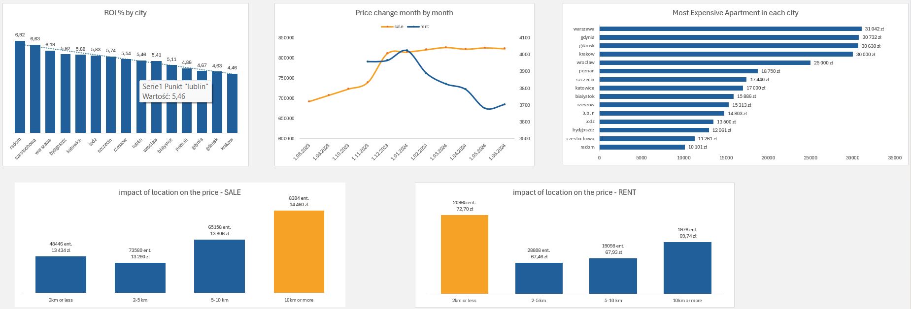

# Polish Real Estate Market Analysis

An end-to-end data analytics project exploring the real estate market (sales and rentals) across 15 major cities in Poland. This repository demonstrates a complete data pipeline: processing raw web-scraped data, structuring a relational database, writing advanced analytical SQL queries, and delivering business insights through data visualization.

**Dataset:** Apartment Prices in Poland (more than 260.000 cleaned records)
**Dataset source:** [Kaggle - Apartment Prices in Poland](https://www.kaggle.com/datasets/krzysztofjamroz/apartment-prices-in-poland/data/code)

## Tech Stack
* **Python (pandas):** Data cleaning and ETL processing.
* **PostgreSQL:** Relational database management, complex querying (CTE, Window Functions, JOINs).
* **Microsoft Excel:** Final data visualization and static dashboard reporting

## Project Structure
```text
├── data/
│   ├── raw/                 # Original scraped CSV files (ignored in git)
│   ├── processed/           # Cleaned dataset ready for SQL import (ignored in git)
│   └── results/             # Query outputs (CSV) used for visualizations (ignored in git)
├── notebooks/
│   ├── 01_combine.ipynb     # Merges 19 raw CSV files, adds offer_type and date_month columns
│   ├── 02_clean.ipynb       # Handles missing values, renames columns, fixes building types
│   ├── setup.sql            # Scripts for table creation and data import
│   ├── ROI_analysis.sql     # Return on Investment logic by city & type
│   ├── pricing_analysis.sql # Premium features and distance-to-center logic
│   └── market_trends.sql    # Time-series analysis and floor impact
└── README.md
```

## Data Architecture

## 1. Data Cleaning using Python
- Merged 19 CSV files for sales and rentals into a unified dataset.
- Created new columns, such as `offer_type` and `year_month` from filenames.
- Handled missing data (e.g., imputing `NULL` floor levels as `Ground Floor (Parter)`)
- Renamed columns to `snake_case` and standardized categorical values for readability (e.g. `blockOfFlats` -> `Block of Flats`, concreteSlab -> Concrete Slab, etc.)

## 2. Database setup (PostgreSQL)
- Designed the database table schema: apartments table includes all the key features: location (city, coordinates), property characteristics (size, rooms, floor, year built), proximity to infrastructure (schools, etc.) and listing details (price, offer type, date).
- Loaded the data: after cleaning and preprocessing the data into `apartments_all.csv`, I imported it using PostgreSQL's command COPY

## 3. Analytical queries (PostgreSQL)
Wrote SQL scripts to extract real business insights from the data:
- **Investment potential**: Calculated rental yield (Return on Investment) by joining aggregated sales and rental data.
- **Feature Impact on pricing**: Segmented prices based on two key factors - `location` (how distance from city center affects the price) and `infrastructure` (what is the additional charge for amenities such as a balcony or parking)
- **Market Trends**: Analyzed how apartment characteristics (size, rooms, floor) differ by city and offer type, plus how inflation affects pricing


# Dashboard & Visualizations
The results of the SQL queries were exported to Excel to construct a clean, executive-level dashboard.


---

# Key Business Insights
